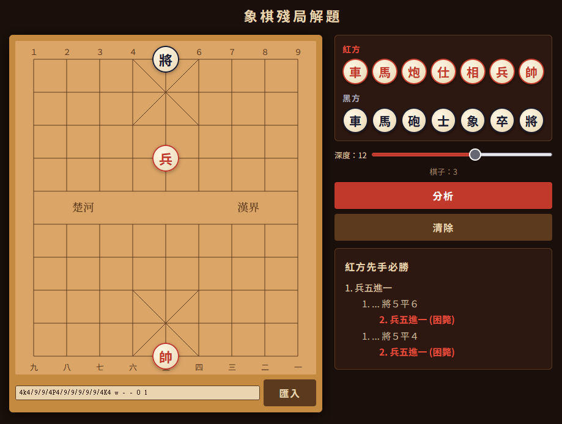

# 中國象棋殘局求解器

純前端中國象棋（象棋）殘局求解器，使用 alpha-beta 剪枝搜尋引擎尋找紅方必勝著法。

## 功能

- 🏁 拖曳擺放棋子（從調色盤拖到棋盤，或棋盤上拖曳調整位置，拖出棋盤外移除）
- 🔍 點擊「分析」自動搜尋紅方必勝著法
- 🌲 展開變著樹，每個黑方應著只顯示唯一紅方必勝路徑
- 📋 FEN 編碼匯入匯出，內建「系統精選」範例局面，並可於「我的範例」自訂儲存（localStorage）
- ⚙️ 可調整搜尋深度（1–20 層），分析中可中斷
- 📱 純前端，無需後端伺服器

## 使用方式

直接用瀏覽器開啟 `index.html`，或存取 GitHub Pages：

**https://buffalobill-taiwan.github.io/cchess-endgame/**

## 技術架構

- 純 HTML/CSS/JavaScript，無框架、無建置工具
- 棋盤使用 SVG 繪製
- 完整的象棋規則引擎（所有七種棋子、王見王、困斃）
- Iterative-deepening alpha-beta 搜尋（可調深度，15 秒時間限制）
- Incremental make/unmake moves（全域棋盤狀態，無拷貝）
- 疊代加深 refutation 搜尋：從 depth 2 開始逐步加深，找到殺棋即停
- 變著樹利用 refutation PV 建構深層子樹，非必勝分枝自動跳過
