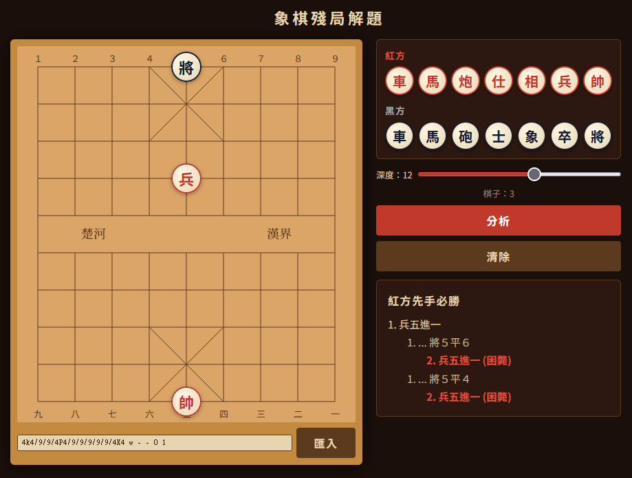

# 中國象棋殘局求解器

純前端中國象棋（象棋）殘局求解器，使用 alpha-beta 剪枝搜尋引擎尋找紅方必勝著法。



## 功能

- 🏁 拖曳擺放棋子（從調色盤拖到棋盤，或棋盤上拖曳調整位置，拖出棋盤外移除）
- 🔍 點擊「分析」自動搜尋紅方必勝著法
- 🌲 展開變著樹，每個黑方應著只顯示唯一紅方必勝路徑
- 📋 FEN 編碼匯入匯出，內建「系統精選」範例局面，並可於「我的範例」自訂儲存（localStorage）
- ⚙️ 可調整搜尋深度（1–12 步，紅方步數；×2 為搜尋半回合數），分析中可中斷
- 📱 純前端，無需後端伺服器

## 使用方式

直接用瀏覽器開啟 `index.html`，或存取 GitHub Pages：

**https://buffalobill-taiwan.github.io/cchess-endgame/**

## 技術架構

- 純 HTML/CSS/JavaScript，無框架、無建置工具
- UI 入口、分析控制、範例 modal、範例儲存分層，核心分析維持 DOM-free
- 棋盤使用 SVG 繪製
- 完整的象棋規則引擎（所有七種棋子、王見王、困斃）
- Iterative-deepening alpha-beta 搜尋（可調深度，15 秒時間限制）
- Incremental make/unmake moves（由搜尋 context 管理的可回復棋盤，不依賴全域引擎棋盤）
- 搜尋與變著樹共用同一個總 deadline；中斷或逾時只提交完整的 iterative-deepening 深度
- 逾時的 refutation 不會被加入結果樹；分析中斷時不顯示部分變著樹
- 疊代加深 refutation 搜尋：從 depth 2 開始逐步加深，找到殺棋即停
- 變著樹利用 refutation PV 建構深層子樹，非必勝分枝自動跳過

## 終端機／其他前端引用

共用入口為 `js/engine.js`（ES module；Node 22+），不會載入 DOM、localStorage 或網頁的全域 `state`。可直接引用本專案路徑，無需建置或安裝套件：

```js
import { parseFen, analyzePosition, generateLegalMoves, applyBoardCopy,
  boardToFen } from './cchess-endgame/js/engine.js';

const { board, sideToMove } = parseFen(fen);
if (sideToMove !== 'w') throw new Error('分析固定由紅方開始');
const result = await analyzePosition(board, {
  depth: 12, // 半回合（plies），相當於網頁滑桿 6 步
  timeLimit: 15000, // 毫秒，包含搜尋與變著樹建構
  continuousCheck: false,
  isCancelled: () => false, // 終端機可接自己的取消旗標
});
console.log(result);

const moves = generateLegalMoves(board, 'red');
if (moves.length) console.log(boardToFen(applyBoardCopy(board, moves[0]), 'b'));
```

棋盤是 10 × 9 的陣列，`board[row][col]` 為 `null` 或 `{ type, color }`；row 0 是黑方底線，row 9 是紅方底線。`color` 為 `red`／`black`，棋種為 `king`、`advisor`、`elephant`、`horse`、`chariot`、`cannon`、`soldier`。走法為 `{ from: { row, col }, to: { row, col } }`。

`parseFen` 回傳 `{ board, sideToMove }`，sideToMove 為 `w`／`b`；規則與走法生成支援雙方，但 `analyzePosition` 與 `searchRootAsync` 固定搜尋紅方。FEN 解析預設允許缺將帥，可用 `{ allowMissingKings: false }` 嚴格檢查。

`analyzePosition` 不修改輸入棋盤，回傳 `{ status, tree, score, interrupted }`。status 為 `ok`、`noKing`、`redMated` 或 `redStalemated`；中斷／逾時時 tree 為 null。樹節點提供 move、notation、color、isMate、isStalemate、children 與 board，顯示方式由呼叫端決定。`applyBoardCopy` 回傳新棋盤；低階 `makeMove`／`unmakeMove` 會原地修改棋盤，呼叫端需自行配對還原。

分層邊界：

- 核心：`engine.js`、`constants.js`、`geometry.js`、`board.js`、`rules.js`、`notation.js`、`zobrist.js`、`search.js`、`tree.js`、`analyze.js`。`canPlaceAt` 是共用擺棋限制，實際對弈請使用 `generateLegalMoves`。
- 瀏覽器介面：`app.js`、`ui.js`、`ui-constants.js`、`state.js`、`example-modal.js`、`example-store.js`。管理畫面、拖曳、網頁工作階段與範例儲存；核心不引用這些模組。

每個呼叫端自行持有棋盤與取消旗標，不需初始化網頁狀態。測試會遞迴檢查核心依賴，防止重新引入瀏覽器模組。

## 測試

使用 `node --test` 執行 `test/` 下的規則、FEN、hash 與搜尋測試；使用 `node bench.mjs <fen> [depth] [timeLimitMs]` 進行 headless benchmark。

### 殘局遊戲棋譜產生器

`tools/game-analyze.mjs` 為其他專案的殘局遊戲產生 JSON 應手表。程式直接展開局面，不預先分析紅方是否必勝；即使初始局面是黑方必勝，也照常產譜。紅方是玩家，每個可達局面的所有合法走法都會納入，包括失誤、非將軍走法，以及敗勢中的抵抗。黑方是電腦，每個局面固定一個回應，樂於陪紅方重複局面：先選能接回已知紅方局面的應手，再嘗試證明一套不敗防守；這兩種情況不要求最快取勝或精確終局距離。若仍無法選出應手，才使用精確勝負搜尋，取最快取勝或最長抵抗。

產譜的 `tools/game-solver.mjs` 會依實際工作量動態選擇搜尋與局面圖，與網頁的局面估分搜尋分開：

1. **先查共用證明。** 搜尋與 `tools/game-retrograde.mjs` 共用同一份已證明勝負、精確距離及應手。搜尋遞迴節點也會查詢；有深度邊界時，超出邊界的殺步證明不會掩蓋其他尚未發現的更短取勝路線。
2. **先做少量搜尋。** 先嘗試最多兩個半回合、合計最多 2,000 個搜尋節點，優先解掉立即取勝等簡單情況。
3. **試探實際局面圖。** 每批先展開 256 個新節點，再依實際待展開／已處理比例增加批量，最多每批 4,096 個。大量路徑匯合時繼續建圖；邊界快速增長或達到實際節點／邊數預算時，回到迭代加深搜尋。已完整生成合法走法的節點會保留，下次試探或續算可重用。未完成的圖保持「未知」，不會判和。
4. **完整圖才反向推導。** 從缺將帥或無合法走法的終局向前驅傳遞結果：有一步能贏就取最短距離；全部走法都輸才判必敗，取最長距離；完整傳遞後剩下的局面為和棋。已證明局面可作為圖的邊界，不必重展開。

黑方只有一個合法走法時直接採用；有多個走法時先檢查是否能接回已知紅方局面，找到就記錄連結，尚未完成的目標局面仍保留在待辦中。否則先做最多 20,000 個節點的不敗防守試探：紅方節點必須涵蓋全部合法走法，黑方節點只需找到一個可守住的應手；路徑重複可封閉分支，深度邊界仍視為未知。只有整套防守成立才發布快取，失敗分支依賴的循環假設會一併撤回。不敗防守與精確勝負／距離證明分開儲存，也會納入工作快照。試探未完成時回到上述精確求解。暫時搜尋資料採 LRU 淘汰，最多 100,000 筆；已證明結果另存，不會跟著清空。

搜尋中的循環按可持續重複的和棋路線處理，不套用長將／長捉判負；只有搜尋已排除未解邊界，才可證明和棋。輸出保留循環的局面連結，黑方可以為了重用局面而放棄更快取勝；接回已知局面是產譜策略，不會被寫成該局面的和棋證明。相同黑方待走局面只選一次，之後共用既有表項；相同紅方待走局面只展開一次。因此有限張表可表示無限重複的對局。

若搜尋模式的黑方選擇到達深度上限仍未證明，或任一模式整體逾時，工具以錯誤結束，不輸出部分 JSON。stderr 會提供未解 FEN、中斷階段（應手表展開／步數推導）、已開始／完整展開／待處理的局面數、黑方求解耗時、局面圖查詢／展開／已求解快取數、唯一合法應手與重用應手次數、當下路徑及主要分支。分支統計依首次發現路徑歸屬，僅涵蓋截至中斷的資料。stdout 維持空白，退出碼為 1；可加上 `2> analysis.log` 保存報告。

```bash
node tools/game-analyze.mjs \
  --name "題目名" \
  --fen "<完整 FEN>" \
  --depth 64 \
  --time-limit 60000 \
  --pretty
```

輸出包含 `meta.name`、沿應手表從初始局面取勝的最少紅方步數 `meta.step`、初始棋盤欄位 `meta.init`，以及紅方走完後的棋盤欄位到黑方應手後棋盤欄位的 `table`。應手表完成後，才由 `tools/game-steps.mjs` 從初始局面以廣度優先搜尋尋找可達的 `null` 表項；每個紅方走法計一步，黑方沿表中固定應手前進，重複局面只走訪一次。若沒有可達的紅方勝局，`meta.step` 為 `null`，仍輸出完整棋譜。紅方走後已終局的表項為 `null`；黑方走後若終局，仍記錄該棋盤，消費端應檢查終局並停止遊戲。

參數預設與限制：

- `--depth 64`：未能由局面圖或既有證明解決時的搜尋深度（plies）。不限制已完成證明的重用、局面圖求解、棋譜長度或步數推導。
- `--time-limit 60000`：本次執行的求解與產譜時間，毫秒。續算會獲得新的時間預算。
- `--graph-nodes 50000`、`--graph-edges 400000`：單次局面圖的實際節點／邊數上限，也限制保留的圖展開暫存大小。它們用於控制工作量與記憶體，已證明結果另存；不再用棋子位置數的乘積判斷大小。

例如 `4k4/9/9/4P4/9/9/9/9/9/4K4 w - - 0 1` 即使 `--depth 1` 也能藉由局面圖完成。短殺題仍可能有龐大的其他抵抗分支，不能只按最佳殺步長度推估產譜成本。

### 保存工作與續算

工具預設自動保存及續算：以標準化棋盤 FEN 加上紅方行棋標記的 SHA-256 為檔名，存至 `/tmp/checkpoint-{hash}.json`（依系統暫存目錄，設定 `TMPDIR` 可改位置）。再次執行相同局面會讀取既有進度，不需要加 `--resume`；題目名稱與 FEN 回合計數不影響 hash，輸出名稱使用本次 `--name`。已完成的快照也可重用。

工具會在開始、每隔約一秒的安全檢查點、完成或失敗時保存工作。快照包含題目、已完成應手、目前紅方走法索引、待展開局面、共用證明、暫時搜尋資料、已完成的搜尋深度、當前搜尋工作堆疊，以及未完成圖的節點、邊與展開游標。每個完整應手與其待展開目標一起提交，避免續算漏掉玩家分支。

直接重跑原指令即可自動續算；每次執行都有新的 `--time-limit` 時間額度。自動續算保留較高的既有深度／圖預算；若明確指定比快照更低的限制，則重新計算。

- `--fresh`：忽略既有自動快照，重新計算並保存。
- `--no-checkpoint`：不讀取也不寫入快照。
- `--checkpoint <路徑>`：從頭計算，保存至指定位置。
- `--resume <路徑>`：明確讀取指定快照，預設寫回同一路徑。

手動指定位置的範例：

```bash
node tools/game-analyze.mjs \
  --name "題目名" --fen "<完整 FEN>" \
  --checkpoint work.json --time-limit 60000 > game.json

node tools/game-analyze.mjs \
  --resume work.json --time-limit 120000 > game.json
```

`Ctrl-C`／`SIGTERM` 由主執行緒接收，工作執行緒會在求解檢查點停止並保存快照；逾時或未解也會保存。失敗時 stdout 保持空白，stderr 顯示快照位置，退出碼為 1。只有完整棋譜才會寫入 stdout；`work.json` 是獨立工作格式，不能直接當作遊戲棋譜。

`--resume` 會繼承快照中的題目、深度與圖預算，並預設繼續寫回原快照。可用 `--checkpoint` 指定新的保存位置；可提高 `--depth`、`--graph-nodes`、`--graph-edges`，但不能降低。若另行指定名稱或 FEN，必須與快照相符。

快照包含格式版本、引擎原始碼指紋與校驗碼；自動快照不相容或損壞時，會在 stderr 提示並重新計算；明確使用 `--resume` 則拒絕讀取並停止。寫入採同目錄暫存檔再原子替換，保留最後一份完整快照。未完成的主要搜尋會接續保存的工作堆疊，保留各層走法索引、搜尋上下界、最佳結果與重複局面判定所需資訊；不必重跑整個深度。局面圖分批探測直接接續既有節點與連邊游標，續算時只還原一次索引。當前節點尚未完成的走法生成、可選的同分應手探測，以及圖完成後的勝負反向傳遞仍可能重跑；反向傳遞使用獨立副本，未完成結果不會當成證明。

瀏覽器手動驗收建議：

- 從調色盤拖曳棋子到合法與非法位置，確認合法位置提示與棋子數量。
- 拖曳棋盤上的棋子移動、拖出棋盤移除，確認 FEN 同步更新。
- 匯入 `w` FEN 與 `b` FEN，確認工具只接受紅方 `w` 分析。
- 分析中按「中斷」，確認不顯示未完成變著樹，且控制項恢復可用。
- 點擊結果樹節點與「原始局面」，確認棋盤可正確還原。
- 在「我的範例」新增、載入、刪除資料，並測試 localStorage 不可用時的錯誤提示。

### 連將殺專用產譜工具

`tools/endgame-analyze.mjs` 採三階段有限局面圖分析，輸入與輸出的棋譜 JSON 格式和 `game-analyze.mjs` 相同：

1. **窮舉紅方連將。** 紅方只展開合法叫將，黑方展開全部合法應將；以棋盤及行棋方去重，保留循環連結。
2. **固定黑方策略。** 從完整圖反向推導，黑方依序選擇強制斷將／取勝、循環避敗、必敗時最長抵抗。能強制斷將時取最短距離；同級同距離依走法座標排序。保留所有紅方叫將選擇，刪掉不再可達的局面。初始局面必須能強制連將取勝。
3. **補齊失誤與反殺。** 加入保留局面的全部非叫將走法，要求黑方能對紅方所有合法抵抗強制連將取勝。黑方每一步必須叫將，循環不算取勝。第二階段已固定的應手不回溯改選；任何失敗都回報問題 FEN、到達路線與可用的抵抗見證，不輸出部分棋譜。

第三階段以多個失誤局面為起點，逐層展開叫將圖並反向證明。黑方已有一步將死時，省略其他較差的黑方選擇；紅方抵抗仍全部保留。未展開邊界保持未知，只有完整圖中的剩餘循環才能判和。所有失誤入口都證明必殺、且完整展開深度足以排除更短殺法後，即可停止探索其餘黑方選擇。若已證明某入口無法連將反殺，可提前報錯；顯示的第三階段探索數是截至停止時發現的局面數。

```bash
node tools/endgame-analyze.mjs \
  --name "連將殺" \
  --fen "3k2c2/1P2n1N2/4bP3/9/9/9/r6R1/3p5/4p4/3K3C1 w - - 0 1" \
  --no-checkpoint > game.json
```

stdout 只輸出 `{meta: {name, step, init}, table}`；stderr 顯示各階段局面數，分列紅方／黑方／總數、第二階段刪除數，以及第三階段完成後的新增局面數與表項數。局面數包含終局節點，按棋盤及行棋方去重；最終數跨階段去重。`step` 是沿最終應手表取勝的最少紅方步數。

參數名稱與原工具一致，時間預設 60,000ms，每個階段工作圖預算預設 50,000 節點／400,000 邊。`--depth` 僅作相容參數，不限制完整局面圖。預算或時間不足會回報「分析未完成」，不會誤判題目不合格。大型失誤圖可提高 `--graph-nodes`、`--graph-edges` 和 `--time-limit`。

自動快照使用獨立的 `/tmp/checkpoint-endgame-{hash}.json`（遵循 `TMPDIR`），不覆蓋原工具快照。支援 `--checkpoint`、`--resume`、`--fresh`、`--no-checkpoint` 與 `--pretty`。快照保存階段、圖展開游標、反向傳遞佇列、固定策略及最後步數搜尋進度；逾時與 Ctrl-C 可保存續算。圖未完成的分類不得作為和棋證明；續算完成後才輸出完整棋譜。手動讀取不相容快照會報錯，自動快照不相容時則提示並重算。

目前範例結果（`w - - 0 1` 省略）：

| 範例 | 第一階段 | 第二階段 | 第三階段探索 | 最終結果 |
|---|---:|---:|---:|---|
| `3k2c2/1P2n1N2/4bP3/9/9/9/r6R1/3p5/4p4/3K3C1` | 9 | 9 | 196 | 四步殺；205 個局面、103 筆應手 |
| `3a1aC2/2PcPn3/2nkb3R/7C1/6b2/9/9/9/5p3/2rAK1p2` | 6,443 | 591 | 16,355 | 有四步連將殺，但失誤分支無法保證連將反殺 |
| `3a1aC2/2PcPn3/2nkb3R/7C1/6b2/9/9/9/5p2r/2rAK4` | 3,523 | 519 | 13,118 | 有四步連將殺，但失誤分支無法保證連將反殺 |
| `3a1aC2/2PcPn3/2nkb3R/7C1/6b2/9/9/9/5p2r/cr1AK4` | 3,523 | 519 | 29,952 | 四步殺；7,641 個局面、3,874 筆應手 |

失敗時第三階段探索數不是完整應手表大小，亦不表示黑方在不限叫將的一般對局中無法取勝。
